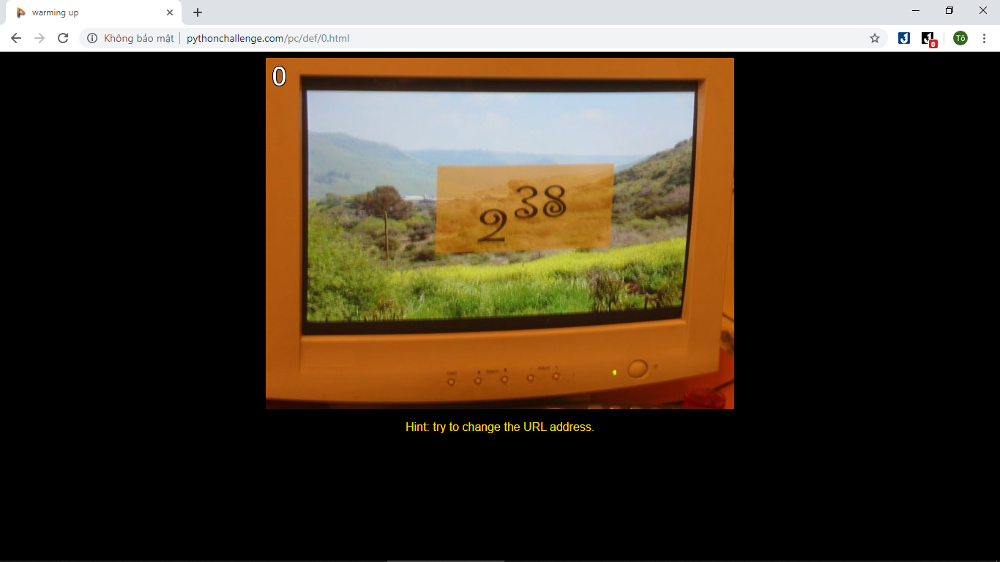

nhìn vào ảnh

- chúng ta có hint: cố gắng thay đổi địa chỉ URL.
- Để ý URL một chút, chúng ta thấy nó là 0.html, vây chắc chắn là cần phải thay số 0 này thành số khác. Quá dễ, ảnh ghi 238 thì điền 238 vào là xong.
- nhưng khi thay đổi thì 

vậy là chúng ta sai
- chuyển qua xem source, thì mình để ý thấy bức ảnh có tên là `calc.jpg`, gợi ý rằng chúng ta phải tính toán, chứng tỏ chúng ta cần tính toán

- thấy 38 ở trên một chút so với 2. Nghĩ đi nghĩ lại thì cuối cùng hiểu ra rằng, người ta đang vẽ 2 mũ 38 chứ không phải 238. Vậy là chỉ cần tính 2^38 rồi thay URL là xong. Với Python thì tương đối đơn giản:
```sh
>>> 2 ** 38
274877906944
```
Vậy URL cho level tiếp theo sẽ là 274877906944.html. 

Truy cập trang này chúng ta sẽ được redirect đến một trang khác, với một bức ảnh khác

vậy là đã xong level 0. ahihi
